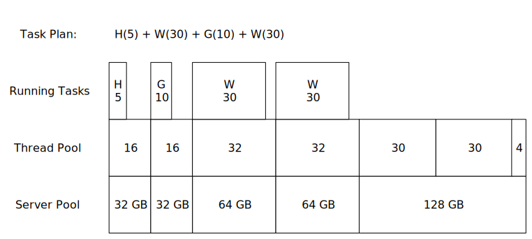

## HVMind Distributed Computing System

**Deprecation notice: This system depended on the ability to write arbitrary objects to NetScript ports, which is no longer supported.**

### ThreadPool

[ThreadPool](thread-pool.js) is a [grid computing](https://en.wikipedia.org/wiki/Grid_computing) system that dispatches jobs to long-lived worker processes running in the cloud.

The system is controlled through a `ThreadPool` process which communicates with `Worker` processes through a [Netscript Port](https://bitburner.readthedocs.io/en/latest/netscript/netscriptmisc.html#netscript-ports). The processes can connect to each other after being launched in any order, including reloading from save.

An application can dispatch tasks to the `ThreadPool` and it will launch an appropriate size `Worker` on any available server (using [ServerPool](../net/deploy-script.js)), or assign the task to an already running `Worker`.




#### ThreadPool API

Applications can run jobs by calling `threadPool.dispatchJob(job)`, where a job is an object defining the `task`. For example:

```JavaScript
{
    task: 'hack',             // a key in worker.capabilities
    args: ['foodnstuff'],
    threads: 5,
    duration:  1000,          // optional
    startTime: 1649093514728, // optional (will start immediately if omitted)
    endTime:   1649093515728  // optional
}
```

When the job runs, this object will be updated with `startTimeActual` and `endTimeActual`. Other fields will be preserved, so a user can record expectations here and compare them against results.

To run multiple jobs at once, call `threadPool.dispatchJobs(batch)`. This will return a falsey value if the entire batch cannot be run. This will update each job’s `startTime` and `endTime` 


#### ThreadPool Command-Line Interface

Start the thread pool:
```
> run /botnet/thread-pool.js --tail
```

Run an application on the pool:
```
> run /hacking/manager.js foodnstuff
```

