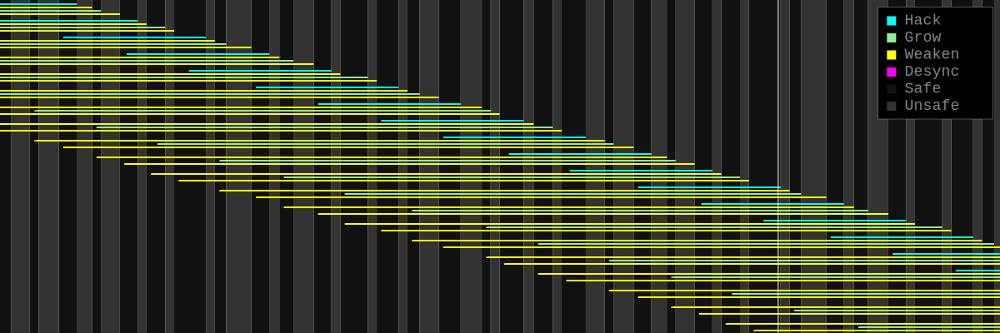

## Bitburner Hacking Optimization System

The game [Bitburner](https://danielyxie.github.io/bitburner/) includes a “hacking” mechanic which consists of three operations:

- `hack`: Transfer money from a server to the player, and increase the server’s security level.
- `grow`: Increase money on a server (from nowhere), and increase the server’s security level.
- `weaken`: Reduce a server’s security level.

The duration of each operation is determined when the operation **starts**, and it depends on the server’s current security level.

The effect of each operation is determined when the operation **ends**, and its magnitude depends on the amount of RAM allocated to the operation.

Basic gameplay consists of running these operations sequentially. Running multiple copies in parallel can create a positive feedback cycle in the gameplay loop:


Scheduling them to run in parallel without interfering with each other is a [bounded knapsack problem](https://en.wikipedia.org/wiki/Knapsack_problem) based on these constraints:

- maximum total RAM used
- maximum RAM used per operation
- minimum time between effects

The [standard strategy](https://bitburner.readthedocs.io/en/latest/advancedgameplay/hackingalgorithms.html) is to repeat batches of `hack`-`weaken`-`grow`-`weaken` operations, ensuring that each starts in a “safe window” when security level is predictable (*cf.* Stalefish [1]). This system considers a wider range of strategies, some of which can be better packed into available timeslots or RAM banks.




1. Fish S. (2022), Periodic Batching, *J. Bitb. Disc.*


---

### Algorithms

#### Batch Planning Algorithm

We create a mutable server object starting from the current state, and apply operations to it until it reaches a goal state. The list of operations is a `Batch` data structure which can be scheduled and launched by a separate process.

The planning algorithm considers these parameters:

- `moneyPercent`: Portion of money to drain with each `hack` job. RAM used by each batch will be proportional to this value.

- `maxThreadsPerJob`: Maximum threads for a single job (optional).

- `secMargin`: Allowable security level above minimum, between operations.

  Note that when `secMargin` is 0, this produces HWGW and works well with simple “safe window” scheduling. Using a higher `secMargin` can create large windows of “almost-safe” time which require duration re-calculation for accurate scheduling.


##### Prep Batch Planning

A prep batch alternates weaken and grow to bring the server to max money and min security.

```
while money < max:
    while security > min + secMargin:
        weaken
    grow
while security > min:
    weaken
```

###### Example Prep Batch

```javascript
> server = new HackableServer(ns, "joesguns")
> server.planPrepBatch({maxThreadsPerJob: 1024})
[
    {task: 'weaken', threads:   48, duration: 37275.3, …},
    {task: 'grow',   threads: 1024, duration: 29820.2, …},
    {task: 'weaken', threads:  122, duration: 37275.3, …},
    {task: 'grow',   threads:  435, duration: 29820.2, …},
    {task: 'weaken', threads:   66, duration: 37275.3, …}
]
```


##### Hacking Batch Planning 

A hacking batch is a hack operation followed by a prep batch.

```
hack
while security < min + secMargin:
    grow
    hack
prep
```

###### Example Hacking Batch

```javascript
> server = new HackableServer(ns, "joesguns").preppedCopy()
> server.planHackingBatch({secMargin: 0})
[
    {task: 'hack',   threads: 11, duration:  8799.3, …},
    {task: 'weaken', threads: 25, duration: 35197.2, …},
    {task: 'grow',   threads: 49, duration: 28157.8, …},
    {task: 'weaken', threads: 29, duration: 35197.2, …}
]
```


##### Batch Cycle Planning

A cycle of batches is the maximum number of parallel batches based on these constraints:

- `tDelta`: minimum time between effects (milliseconds)
- `maxTotalRam`: maximum total RAM used at once

We calculate the number of parallel batches as the minimum of:

- `maxTotalRam` / batch peak RAM
- batch duration / (number of jobs * `tDelta`)

###### Example HWGW batch cycle

```javascript
const server = new HackableServer(ns, "phantasy");
const params = {
    tDelta: 100,
    maxTotalRam: 16384,
    maxThreadsPerJob: 512,
    moneyPercent: 0.05,
    secMargin: 0,
};
const batchCycle = server.planBatchCycle(params);
console.log(batchCycle.condition); // " 5% HWGW"
const batch = batchCycle.batch;
```


#### Profit Maximization Algorithm

##### Parameter Selection

We sweep values of `moneyPercent` and `secMargin` (with fixed RAM and timing limits) to find the most profitable cycle. 

```
set minimum time between effects
measure available RAM
for moneyPercent from 0.0 to 1.0:
    for secMargin from 0.0 to 0.5 (optional):
        plan a batch cycle with these constraints and parameters
        calculate total money per second (after prep)
select the cycle with the most money per second
```

> NOTE: This approach spends a lot of computation on parts of the `moneyPercent` range which are obviously not optimal. It would be possible to plan individual batches based on the RAM limit instead of the `moneyPercent` input.

###### Example Parameter Selection

```
> run /hacking/planner.js phantasy --maxTotalRam 16384 --tDelta 100
```

```
Comparison of batches with at most 16.4 TB RAM, at most 1024 threads per job
┌───────────────────┬─────────┬───────┬──────────┬───────────┐
│ Condition         │ Batches │ Max t │ RAM Used │   $ / sec │
├───────────────────┼─────────┼───────┼──────────┼───────────┤
│  2.5% HGHGHGHGHGW │      45 │    17 │   6.3 TB │    $58.4m │ -- Limited by time
│  5.0% HGHGHGW     │      72 │    34 │  12.1 TB │   $111.5m │    between actions
│  7.5% HGHGHGW     │      69 │    48 │  16.2 TB │   $147.3m │
│ 10.0% HGW         │     154 │    63 │  16.4 TB │   $153.4m │ -- Maximum $ / sec
│ 12.5% HGHWGW      │      63 │    78 │  16.2 TB │   $149.7m │
│ 15.0% HGW         │     103 │    96 │  16.4 TB │   $149.4m │
│ 20.0% HWGW        │      76 │   130 │  16.2 TB │   $144.7m │
│ 30.0% HWGW        │      49 │   205 │  16.1 TB │   $135.5m │
│ 40.0% HWGW        │      36 │   293 │  16.4 TB │   $128.6m │ -- Limited by
│ 50.0% HWGW        │      27 │   396 │  16.0 TB │   $116.6m │    total RAM
│ 60.0% HGHWGW      │      11 │   533 │  16.4 TB │   $105.7m │
│ 70.0% HWGW        │      17 │   685 │  16.0 TB │    $94.4m │
│ 80.0% HWGW        │      13 │   914 │  15.4 TB │    $77.6m │
│ 82.5% HWGW        │      12 │   999 │  15.2 TB │    $72.5m │
│ 85.0% HWGWGW      │      12 │  1024 │  16.1 TB │    $73.8m │ -- Limited by threads
│ 87.5% HWGWGW      │      11 │  1024 │  16.3 TB │    $69.8m │    per process
│ 90.0% HWGWGW      │      10 │  1024 │  16.2 TB │    $65.1m │
│ 92.5% HWGWGW      │       8 │  1024 │  14.7 TB │    $53.7m │
│ 95.0% HWGWGW      │       7 │  1024 │  14.6 TB │    $48.1m │
│ 97.5% HWGWGWGW    │       6 │  1024 │  15.8 TB │    $42.3m │
└───────────────────┴─────────┴───────┴──────────┴───────────┘
```

#### 

##### Target Selection

We sweep profit maximization over all targets to find the best target:

```
for all hackable targets:
    calculate maximum money per second (after prep)
    calculate total money in first hour (including prep)
select target with most total money in first hour
```

###### Example Target Selection

```bash
> run /hacking/planner.js --maxTotalRam 16384 --tDelta 100
```

| Hostname         |     $ | Batch  | Prep Time | Ram Used | $ / sec |
| ---------------- | ----: | ------ | --------: | -------: | ------: |
| alpha-ent        |  5.0% | HGHWGW |     27:38 |  16.3 TB | $153.6m |
| phantasy         | 10.0% | HGW    |      0:49 |  16.4 TB | $153.4m |
| rho-construction |  5.0% | HWGW   |     27:18 |  16.4 TB | $150.0m |
| the-hub          |  5.0% | HWGW   |     14:02 |  16.4 TB | $142.1m |
| max-hardware     | 15.0% | HGHWGW |      1:21 |  16.3 TB |  $89.0m |
| omega-net        |  2.5% | HGW    |      6:52 |  16.4 TB |  $87.7m |
| silver-helix     |  5.0% | HGHWGW |      4:42 |  16.2 TB |  $84.5m |
| computek         |  5.0% | HGW    |     21:37 |  16.3 TB |  $80.9m |
| foodnstuff       | 10.0% | HGHWGW |      0:13 |  16.0 TB |  $13.4m |
| n00dles          | 82.5% | HGHGW  |      0:08 |   2.3 TB |   $4.4m |

#### 

#### Batch Scheduling Algorithm

We track this information about a target server:

- `prevEndTime`  - the last effect scheduled for the target
- `expectedSecurity` - array of `[time, security]` pairs for planned effects

When scheduling a new batch:

```
initialize prevEndTime to now
for each job in the batch:
    initialize job.endTime to prevEndTime + tDelta
    shift job times so that job.startTime > now
    shift job times so that job.startTime is in a safe window of expectedSecurity
    set prevEndTime to job.endTime
append each [endTime, security] pair to expectedSecurity
```

> NOTE: this algorithm can get into a trap with HGW batches, where the startTimes are aligned instead of the endTimes


---

### Modules

This system consists of loosely-coupled modules:

[Hacking Planner](#Hacking_Planner) is a library for planning batches of `hack`, `grow`, and `weaken` jobs, scheduling them, and optimizing their parameters.

[Hacking Manager](#Hacking_Manager) is a frontend for executing job batches. It matches job `endTime` with availability on target servers.

[ThreadPool](../botnet/) is a backend that dispatches jobs to long-lived [Worker](worker.js) processes. It matches job `startTime` with availability on workers.

[ServerPool](../net/deploy-script.js) launches processes in available RAM banks.

[BatchView](#BatchView) is a visualizer for hacking operations.

---


### Hacking Planner

[planner.js](planner.js) is a library for planning batches of `hack`, `grow`, and `weaken` jobs, scheduling them, and optimizing their parameters.

It depends on
- [server-list.js](../net/server-list.js) for listing hackable servers
- [batch-model.js](../hacking/batch-model.js) for calculating schedules
- [box-drawing.js](../lib/box-drawing.js) for displaying tables
- [stocks/trader.js](../stocks/trader.js) (optional) for stock position information

#### Planner Command-Line Interface

When run as an executable, it displays the most profitable parameters for each hackable server.

```bash
> run /hacking/planner.js [--maxTotalRam n] [--maxThreadsPerJob n] [--tDelta n]
```


#### Planner API

Planner defines these data structures:
```	
HackableServer: mutable snapshot of a Netscript Server
    planHackJob(moneyPercent) -> Job
    planGrowJob() -> Job
    planWeakenJob() -> Job
    planPrepBatch(params) -> Batch
    planHackingBatch(params) -> Batch
    planBatchCycle(params) -> {batch, params, period, peakRam, ...}
    mostProfitableParameters(constraints) -> params
```
```
HackPlanner:
    loadServer(hostname) -> HackableServer
    mostProfitableServers(constraints) -> BatchCycle[]
```
(see also `Job` and `Batch` from [batch-model.js](../hacking/batch-model.js))

Many methods of these objects take a `params` object with parameters to be passed on to subroutines:

```
Params: {
    tDelta:           Milliseconds between endTime of jobs targeting the same server
    maxTotalRam:      Maximum total GB of ram to use for multiple concurrent batches
    maxThreadsPerJob: Maximum number of threads to use on any single process
    moneyPercent:     Portion of money to take in a hack job (0.0 - 1.0)
    secMargin:        Amount of security to allow without weakening between jobs
    naiveSplit:       Whether to split large jobs into sequential processes of the same kind.
                      For example: HWWGGGWW (naive) vs HWGWGWGW (default)
    cores:            Number of CPU cores used for a job
}
```


###### Example: Prepare a server using sequential steps in one process

```javascript
import { HackableServer } from "/hacking/planner";

const server = new HackableServer(ns, hostname);
const batch = server.planPrepBatch({
    maxThreadsPerJob: ns.getRunningScript().threads
});
for (const job of batch) {
    // execute the task in this process
    await ns[job.task](...job.args);
}
```


###### Example: Run a hacking batch on parallel processes

```javascript
import { HackableServer } from "/hacking/planner";

const server = new HackableServer(ns, hostname);
const params = server.mostProfitableParameters({maxTotalRam: 16384});
const batch = server.planHackingBatch(params);
for (const job of batch) {
    // execute the appropriate process to run the job
    backend.dispatch(job);
}
```

---


### Batch Model

[batch-model.js](batch-model.js) defines the `Batch` class, an array of `Job` specifications with methods for calculating RAM usage and scheduling run times. It is used by various hacking planners and runtimes.

It defines these data structures:

```
Job: {task, args, threads, startTime, duration, endTime}
```

```
Batch: Array[Job], ordered by intended endTime
    peakRam()
    avgRam()
    activeDuration()
    totalDuration()
    setStartTime()
    setFirstEndTime()
    maxBatchesAtOnce()
    minTimeBetweenBatches()
```


---


### Hacking Manager

[manager.js](../botnet/manager.js) is a frontend for executing job batches calculated by [Planner](#Hacking_Planner). It matches job `endTime` with availability on target servers. It delegates execution to a backend that can match job `startTime` with availability in RAM banks.

It depends on [planner.js](#Hacking_Planner) and some backend such as [ThreadPool](../botnet/). The backend must implement the `dispatchJobs(batch)` method, which should return a falsey value if it is not able to run the entire batch, and may adjust the timing of the batch.

#### Manager Command-Line Interface

```bash
> run /hacking/manager.js [target ...] [--maxTotalRam n] [--maxThreadsPerJob n] [--tDelta n]
```


###### Example: Hack the server `phantasy` using up to 5TB of total RAM:

Start the backend, such as [ThreadPool](../botnet/):

```bash
> run /botnet/thread-pool.js --tail
```

Then run Hacking Manager:

```bash
> run /hacking/manager.js phantasy --tail --maxTotalRam 5000
```


---

### Dependencies

The scripts currently used by this system are:

##### Frontend:
```
/lib/box-drawing.js       (optional but hard-coded)
/hacking/batch-view.js    (optional but hard-coded)
/net/server-list.js
/hacking/batch-model.js
/hacking/planner.js
/stocks/trader.js         (optional)
```

##### Minimum Backend (single-use scripts):
```
/net/deploy-script.js
/hacking/worker.js
```

##### Alternative Backend (remote-controlled workers):
```
/lib/port-service.js
/net/deploy-script.js
/botnet/thread-pool.js
/botnet/worker.js         (maybe make this adaptive so we don't need 4 separate ones)
/botnet/worker-hack.js
/botnet/worker-grow.js
/botnet/worker-weaken.js
/botnet/manager.js
/botnet/prep.js           (optional)
```

---

### BatchView

[batch-view.js](batch-view.js) API brainstorming:

```bash
run /hacking/batch-view.js
run hack.js
```

hack.js:

```javascript
const target = ns.args[0] || 'foodnstuff';
const batchView = ns.getPortHandle(10).peek();
batchView.addServerState(ns.getServer(target), performance.now());
const job = {task: 'hack', target, startTime: performance.now(), duration: _, result: _};
batchView.addJob(job);
job.resultActual = await ns.hack(target);
job.endTimeActual = performance.now();
batchView.addServerState(ns.getServer(target), performance.now());
```

this would require:
    ServerInfo Service to be running (if called from `worker.js`)
    BatchView to depend on PortService (maybe)

since BatchView doesn't call any netscript functions, it can operate as a zombie.
(but the kill/run button is useful for stopping animation)
