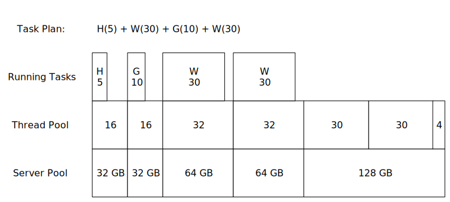

## HVMind Distributed Computing System

This is a system for optimizing the “hacking” mechanic in the game [Bitburner](https://danielyxie.github.io/bitburner/).

The game mechanic consists of three operations:

- `hack`: Transfer money from a server to the player, increase the server’s security level.

- `grow`: Increase money on a server, increase the server’s security level.

- `weaken`: Reduce a server’s security level.

The duration of each operation is determined when the operation starts, and it depends on the server’s current security level.

The effect size of each operation is determined when the operation ends, and it depends on the amount of RAM allocated to the operation.

Scheduling these operations for maximum profit per second is a [bounded knapsack problem](https://en.wikipedia.org/wiki/Knapsack_problem). Here we implement an algorithm for optimizing the schedule of these operations based on these constraints:

- maximum total RAM used
- maximum RAM used per operation
- minimum time between effects

---

### Modules

This system consists of loosely-coupled modules:

[planner.js](planner.js) is a library for planning batches of `hack`, `grow`, and `weaken` jobs, scheduling them, and optimizing their parameters.

[manager.js](manager.js) is a frontend for executing job batches. It matches job `endTime` with availability on target servers.

[ThreadPool](thread-pool.js) is a backend that dispatches jobs to long-lived [Worker](worker.js) processes. It matches job `startTime` with availability on workers.

[ServerPool](../net/server-pool.js) is a backend that launches processes in available RAM banks. It can optionally split threads among multiple processes.

[box-drawing.js](../lib/box-drawing.js) is a library for printing tables of data.

---

#### Planner

[planner.js](planner.js) defines these data structures:

```
Job: {task, args, threads, startTime, duration, endTime}
```
```
Batch: Array[Job], ordered by ascending endTime
	peakRam()
	avgRam()
	activeDuration()
	totalDuration()
	setStartTime()
	setFirstEndTime()
	maxBatchesAtOnce()
	minTimeBetweenBatches()
```
```	
ServerModel: subclass of Netscript Server with planning methods that mutate state
	planHackJob(moneyPercent) -> Job
	planGrowJob() -> Job
	planWeakenJob() -> Job
	planPrepBatch() -> Batch
	planHackingBatch() -> Batch
	planBatchCycle() -> {batch, params}
	mostProfitableParameters() -> params
```

Many methods of these objects take a `params` object with parameters to be passed on to subroutines:

```
Params: {
	tDelta: Milliseconds between endTime of jobs targeting the same server
	maxTotalRam: Maximum total GB of ram to use for multiple concurrent batches
	maxThreadsPerJob: Maximum number of threads to use on any single process
	moneyPercent: Portion of money to take in a hack job (0.0 - 1.0)
	hackMargin: Amount of security to allow without weakening after a hack job
	prepMargin: Amount of security to allow without weakening after a grow job
	naiveSplit: Whether to split a large job into multiple processes with the same endTime.
	            For example: HWGGGWWW (naive) vs HWGWGWGW (default)
	cores: Number of CPU cores used for a job
}
```

##### Planner Command-Line Interface

When run as an executable, calculate the most profitable parameters for each hackable server:

```bash
> run /hive/planner.js
```

| Hostname | $ | Batch | Prep Time | Ram Used | $ / sec |
| ---- | ----: | ---- | ----: | ----: | ----: |
| alpha-ent          |  5.0% | HGHWGW  |     27:38 |  16.3 TB |   $153.6m |
| phantasy           | 10.0% | HGW     |      0:49 |  16.4 TB |   $153.4m |
| rho-construction   |  5.0% | HWGW    |     27:18 |  16.4 TB |   $150.0m |
| the-hub            |  5.0% | HWGW    |     14:02 |  16.4 TB |   $142.1m |
| max-hardware       | 15.0% | HGHWGW  |      1:21 |  16.3 TB |    $89.0m |
| omega-net          |  2.5% | HGW     |      6:52 |  16.4 TB |    $87.7m |
| silver-helix       |  5.0% | HGHWGW  |      4:42 |  16.2 TB |    $84.5m |
| computek           |  5.0% | HGW     |     21:37 |  16.3 TB |    $80.9m |
| foodnstuff         | 10.0% | HGHWGW  |      0:13 |  16.0 TB |    $13.4m |
| n00dles            | 82.5% | HGHGW   |      0:08 |   2.3 TB |     $4.4m |

It determines the optimum batch for each server by comparing moneyPercent and security margin parameters, with fixed RAM limits:

```
Comparison of batches with at most 16.4 TB RAM, at most 1024 threads per job
┌───────────────────┬─────────┬───────┬──────────┬───────────┐
│ Condition         │ Batches │ Max t │ RAM Used │   $ / sec │
├───────────────────┼─────────┼───────┼──────────┼───────────┤
│  2.5% HGHGHGHGHGW │      45 │    17 │   6.3 TB │    $58.4m │ -- limited by time
│  5.0% HGHGHGW     │      72 │    34 │  12.1 TB │   $111.5m │    between actions
│  7.5% HGHGHGW     │      69 │    48 │  16.2 TB │   $147.3m │
│ 10.0% HGW         │     154 │    63 │  16.4 TB │   $153.4m │
│ 12.5% HGHWGW      │      63 │    78 │  16.2 TB │   $149.7m │
│ 15.0% HGW         │     103 │    96 │  16.4 TB │   $149.4m │
│ 20.0% HWGW        │      76 │   130 │  16.2 TB │   $144.7m │
│ 30.0% HWGW        │      49 │   205 │  16.1 TB │   $135.5m │
│ 40.0% HWGW        │      36 │   293 │  16.4 TB │   $128.6m │ -- limited by
│ 50.0% HWGW        │      27 │   396 │  16.0 TB │   $116.6m │    total RAM
│ 60.0% HGHWGW      │      11 │   533 │  16.4 TB │   $105.7m │
│ 70.0% HWGW        │      17 │   685 │  16.0 TB │    $94.4m │
│ 80.0% HWGW        │      13 │   914 │  15.4 TB │    $77.6m │
│ 82.5% HWGW        │      12 │   999 │  15.2 TB │    $72.5m │
│ 85.0% HWGWGW      │      12 │  1024 │  16.1 TB │    $73.8m │ -- limited by
│ 87.5% HWGWGW      │      11 │  1024 │  16.3 TB │    $69.8m │    threads per
│ 90.0% HWGWGW      │      10 │  1024 │  16.2 TB │    $65.1m │    process
│ 92.5% HWGWGW      │       8 │  1024 │  14.7 TB │    $53.7m │
│ 95.0% HWGWGW      │       7 │  1024 │  14.6 TB │    $48.1m │
│ 97.5% HWGWGWGW    │       6 │  1024 │  15.8 TB │    $42.3m │
└───────────────────┴─────────┴───────┴──────────┴───────────┘
```


---


#### ThreadPool

[ThreadPool](thread-pool.js) is a [grid computing](https://en.wikipedia.org/wiki/Grid_computing) system that dispatches jobs to long-lived worker processes running in the cloud.

The system is controlled through a `ThreadPool` process which communicates with `Worker` processes through a [Netscript Port](https://bitburner.readthedocs.io/en/latest/netscript/netscriptmisc.html#netscript-ports). The processes can connect to each other after being launched in any order, including reloading from save.

An application can dispatch tasks to the `ThreadPool` and it will launch an appropriate size `Worker` on any available server, or assign the task to an already running `Worker`.




---

### Installation

Copy these scripts:
```
/lib/box-drawing.js
/net/server-pool.js
/hive/thread-pool.js
/hive/worker.js
/hive/manager.js
/hive/planner.js
```

### CLI Usage

Start the thread pool:
```
> run /hive/thread-pool.js --tail
```

Run an application on the pool:
```
> run /hive/manager.js foodnstuff
```

### API Usage

Applications can run jobs by calling `threadPool.dispatchJob(job)`, where a job is an object defining the `task`. For example:

```JavaScript
{
    task: 'hack',             // a key in worker.capabilities
    args: ['foodnstuff'],
    threads: 5,
    duration:  1000,          // optional
    startTime: 1649093514728, // optional (will start immediately if omitted)
    endTime:   1649093515728  // optional
}
```

When the job runs, this object will be updated with `startTimeActual` and `endTimeActual`. Other fields will be preserved, so a user can record expectations here and compare them against results.

> TODO: support running a callback as soon as the task finishes


---

#### Design notes

Is it possible to spawn a large number of persistent workers, then control them from a central manager?

```
netlink
    hack-worker.js -t 18
vitalife
    grow-worker.js -t 18
phantasy
    weak-worker.js -t 18

home
    manager.js
        workers: [
            {
                type: hack,
                threads: 18,
                nextFreeTime: 16039234038
                addJob: ({target, threads, startTime, endTime})=>()
            },
            ...
        ]
```
- always assign a job to the smallest worker that can handle it
- if there is no worker of the right type, spawn one
    (use max threads for host, or only the number needed?)
- warn user if we weren't able to start one

Then when we want to schedule a batch:

for each job in the batch:
    - find an existing worker that can schedule the job
    - or spawn a new worker of the right size
    - or split the job over multiple workers (this can change the batch timing)
    - or cancel the batch

----

Class structure:

```
HackPlanner(ns, target)
    planPrep()
    planBatch() (needs ThreadPool to plan thread-splitting, or to embed a delegate function)
        planHack()
        planGrow()
        planWeaken()
    estimateProfit()

HackManager(ns, portNum, targets)
    planners
    threadPool
    runBatchOnPool()

ThreadPool(ns, portNum)
    dispatchJobs()
    dispatchJob()
    largestThreadSizeAtTime()

Worker(ns, portNum, id)
    addJob()

ServerPool(ns, scriptRam)
    smallestServersWithThreads()
    largestServer()
    deploy()
```


